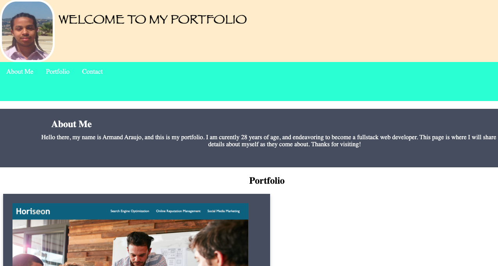

# Armand Araujo Profile  

## Technology Used 

| Technology Used | Resource URL | 
| ------------- |:-------------:| 
| HTML | [https://developer.mozilla.org/en-US/docs/Web/HTML](https://developer.mozilla.org/en-US/docs/Web/HTML) | 
| CSS | [https://developer.mozilla.org/en-US/docs/Web/CSS](https://developer.mozilla.org/en-US/docs/Web/CSS) | 
| Git | [https://git-scm.com/](https://git-scm.com/) | 

## Description 
With this project, I was asked to contruct a profile website where potential employers can visit in order to view the projects and work I've completed. 

[Visit the Deployed Site](https://armand57araujo.github.io/Portfolio/) 

## Code Example 

 
  <!-- removed image from css and added here to html -->

     <article>
    

      <h1 class="top-header">About Me </h1>
      
Hello there, my name is Armand Araujo, and this is my portfolio. I am curently 28 years of age,
        and endeavoring to become a fullstack web developer. This page is where I will share all pertinent details about
        myself as they come about. Thanks for visiting!

    

  </article>

  <main>
    <h2 style="text-align: center;">Portfolio</h2>
    <article>
      

        

          <a href=https://armand57araujo.github.io/Horisean-Consultants>
            <!-- added link for project -->
          </a>
        

        

          <h2>Horiseon Consultants Project</h2>
        

    </article>

Corrected and added email link to "Contact Me" [<a href="mail:some@email.com"](https://www.w3schools.com/tags/tag_address.asp). 

  <footer>
    <section id="contact">
      <h2 class="text-center">Email Me</h2>
      <form>
        <label class="text-right" for="email">Let's Get In Touch:</label>
        <input type="text" id="email" name="user-email">
        

          <button type="submit"><a href="mailto:armand_araujo@yahoo.com">SEND</button>
        

      </form>
    </section>
  </footer>
    
        <!-- changed from Div to Nav -->
        <!-- added closing Header -->
    </header>

 

The challanges I faced additional modification to the HTML file such as in the case of the header where I had added my nav section. Because the addition of the nav in the header, significant overlapping was occurring causing elements within the page to become uncentered and off balance. Correcting the error made it so the sections such as Header, Nav, and About Me were able to operate and flow independently of each other as well as corrected any aesthetic issues.

<body>
  <header>
    
    <h1>WELCOME TO MY PORTFOLIO </h1>

  </header>
  <!-- removed Nave from header -->

  <nav class="topnav">
    <a href="#about me">About Me</a>
    <a href="#portfolio">Portfolio</a>
    <a href="#contact">Contact</a>

  </nav>

  <article>
    

      <h1 class="top-header">About Me </h1>
      
Hello there, my name is Armand Araujo, and this is my portfolio. I am curently 28 years of age,
        and endeavoring to become a fullstack web developer. This page is where I will share all pertinent details about
        myself as they come about. Thanks for visiting!

    

  </article>

## Learning Points 

This was a true challenge, as I was asked to build this entire site from scratch with no starter code. I had to design and then implement said designs in a feasible and reasonable fashion, adhere to the ask, and not come away with a dissapointing final product in terms of the sites appearence. 

## Author Info
Armand Araujo
Age: 28
Location: Santa Barbara, CA

 
* [LinkedIn](https://www.linkedin.com/in/armand-araujo-a82ba2291/) 
* [Github](https://github.com/Armand57araujo) 

## Credits 
